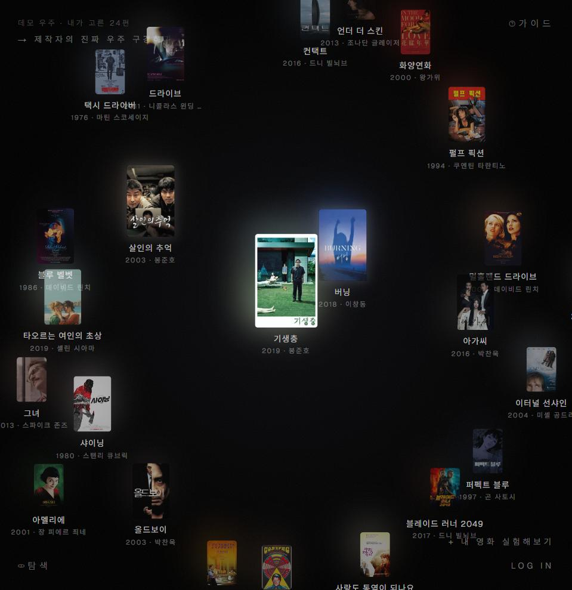
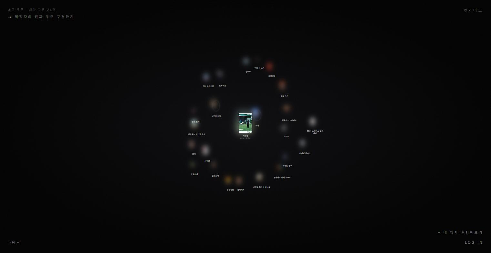
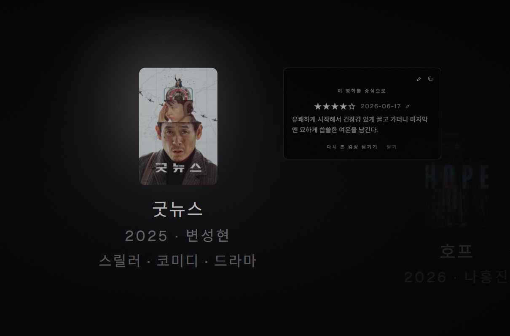

# CINELOG (시네로그)





**영화와 영화 사이, 당신만의 우주.**

**→ [cinelog.dev](https://cinelog.dev)**

## 왜 만들었는지

내가 본 영화들을 기록해둘 공간이 있었으면 했다. 근데 그 기록이 그냥 별점과
한 줄짜리 목록으로 쌓이는 건 원하지 않았다. 영화를 한 편씩 볼 때마다 내
우주가 조금씩 넓어지고 다채로워지는 걸, 직접 눈으로 보고 싶었다.

목록은 아무리 채워도 그냥 목록이다. 나는 그걸 나만의 우주라는 공간에서
미학적으로 꾸미고 싶었다. 감독, 장르, 테마, 시대가 겹칠수록 영화들이 서로
가까워지고, 그 관계가 쌓여서 하나의 풍경이 되는 것.

그래서 리스트 대신 우주를 만들었다. 영화 한 편이 별 하나가 되고, 영화 하나를
중심에 놓으면 우주 전체가 그 영화와의 관계로 다시 배치된다. 포트폴리오로
시작했지만 지금은 내가 진짜 매일 쓰는 걸 목표로 만들고 있다. 팔로우, 좋아요,
댓글은 의도적으로 안 만들었다. 남들에게 보여주려고 만든 게 아니라 내 취향의
모양을 나 스스로 보고 싶어서 만든 거니까.

## 핵심 기능

**중력 기반 배치.** 영화를 하나 선택하면 그 영화를 중심으로 우주 전체가
부드럽게 재배치된다. 별을 클릭하면 카메라가 확대해서 다가가고, 평점, 메모,
감상 이력이 그 자리에서 펼쳐진다.



**우주 성장 히스토리.** 화면 하단 타임라인을 드래그하면 그 시점까지 기록한
영화만 빛나 보인다. 지금의 최종 배치는 그대로 두고 "언제부터 빛났는지"만
다시 보여주는 방식이라, 취향이 시간에 따라 어떻게 자라왔는지가 리스트로는
볼 수 없는 방식으로 드러난다.

**탐색과 인사이트.** "가장 짙은 중력(자주 본 감독)", "가장 흔한 결(장르)"
같은 패턴을 요약해서 보여주고, 누르면 위치는 그대로 두고 해당 별만 밝혀서
그 감독의 작품들이 우주 어디에 흩어져 있는지 한눈에 보여준다.

**비동기 공유.** 실시간 프레즌스나 피드는 없다. 대신 우주 전체(`/u/[slug]`)나
영화 카드 한 장(`/m/[slug]`)을 링크 하나로 공유한다.

**줌 인터랙션.** Ctrl + 휠(모바일은 핀치)로 확대·축소한다. 많이 축소하면
포스터가 그 영화 고유 색의 흐린 빛으로 접혀 보이고, 다시 확대하면 원래대로
돌아온다.

## 기술 스택

- Next.js 16 (App Router, Turbopack), TypeScript, Tailwind CSS, Framer Motion
- Supabase (Postgres + Auth): 이메일 매직링크 로그인, RLS로 내 기록만 나에게 보이게 강제
- TMDB API: 영화 검색과 메타데이터. 서버 라우트로 프록시해서 API 키를 클라이언트에 노출하지 않는다
- Sentry(에러 모니터링), Vercel Analytics(방문자 통계)
- 배포: Vercel

3D 엔진이나 게임 프레임워크는 안 쓴다. 전부 2D/2.5D CSS transform과 Framer
Motion으로 만들었다. 화려함보다 어둠, 여백, 느린 움직임을 우선했다.

## 로컬에서 실행하기

```bash
npm install
cp .env.local.example .env.local   # Supabase/TMDB 키 채워넣기
npm run dev
```

`.env.local`에 필요한 값:

```
NEXT_PUBLIC_SUPABASE_URL=
NEXT_PUBLIC_SUPABASE_ANON_KEY=
TMDB_API_KEY=
```

로그인 없이도 `/`에서 24편으로 채운 데모 우주를 바로 체험할 수 있다. Supabase
연결 없이도 정적 데이터만으로 동작한다.
